## Day 1: The Prime Objective

My goal is to walk you through creating your own AI chatbot &mdash; we'll call it LewisGPT. The prime objective is to:

- give you some real world experience of what being a machine learning engineer is _actually_ like so you can see if it's something you're interested in
- give you a (kick-ass) project that you can show off on your resume, to your friends, or to a potential future employer
- pull back the machine learning curtain to give you an understanding about how state of the art technologies like ChatGPT, Tesla Autopilot, or Google Lens work under the hood.
- give you the sense that you could take on any project and figure out how to tackle it, no matter how big

LewisGPT will use a very similar architecture to what ChatGPT is built on - only at a much, much smaller scale! State of the art machine learning models today take _thousands_ of [Nvidia H100s](https://www.nvidia.com/en-us/data-center/h100/) [days or weeks](https://www.reddit.com/r/GPT3/comments/p1xf10/comment/h8h3sl4/?utm_source=share&utm_medium=web2x&context=3) to train. We're going to attempt to trim that down to about 15 minutes on a consumer-grade GPU. Even on this tiny scale, we'll still see some impressive performance and intelligent-like behavior.

This is incredibly ambitious for four days but the good news is:

- You can keep working on it even after our end date on Thursday &mdash; I love working on this stuff and am happy to hop on a Discord call or message with you to keep in touch on this project. I think this project is a bit ambitious but I think (and I hope you agree) it will be worth it.
  - My Discord username is `delivery`, go ahead and send me an invite
- We use a metric called _loss_ to describe the quality of our AI model (we'll go over this later). The goal this week is to minimize _loss_ as much as we can. There's no strict success or failure &mdash; we're just seeing how low we can get this loss. As we watch the loss drop, we'll see LewisGPT's responses go from complete gibberish to something that looks a little like English.

> **A warning**
Machine learning (and programming in general) can be really frustrating. They say it takes 10,000 hours to master something and that couldn't be more true with software development. I remember it taking me years before I really felt like I knew what I was doing. Even still, programming can be a roller-coaster of highs and lows - I've had bugs take _days_ or _weeks_ to figure out with hours of debugging and banging my head against the desk &mdash; but the highs are just as high as the lows are low - making a project that you're proud of, seeing other people use it, or solving a cool problem gives you a satisfication that I haven't quite found anywhere else. The only thing that separates someone from being an incredible programmer is to never give up - keep pushing through, don't let the frustration let you quit. And at the end of the day, remember that none of us really know what we're doing - we're still toast without Google.

> **Another warning**
Machine learning is much different than other types of software development. Unlike other more concrete types of programming, machine learning is very vibe based. You kind of develop a gut feel about what works and what doesn't. It's incredibly empirical - you try something, see if it works, and if it doesn't, you try something else. There's no real "right" answer - just what works and what doesn't. Some people like this, some don't. If you find it's not your cup of tea, remember, it's just one of many fields in CS you could go in to. None-the-less, it's a really cool field to know at least a little about.

If we have some extra time, we'll also go through creating a basic web interface for LewisGPT to give you a taste of UI design and web development.

## A primer on AI


If you haven't yet, watch [https://www.youtube.com/watch?v=aircAruvnKk](https://www.youtube.com/watch?v=aircAruvnKk). 

I think this video highlights quite well what _types_ of problems AI is really good at. It isn't good for every problem - if there is a closed-form, correct, and performant solution to a problem, you should pick that one before jumping to AI.

However, when the problem is like the one described in the video - a problem where you're not quite sure how'd you even put a solution into words, AI can be a really powerful tool. For example, the [MNIST dataset](https://en.wikipedia.org/wiki/MNIST_database) contains 70,000 images of handwritten digits and is used as a standard benchmark for different machine learning algorithms. Modern state-of-the art neural networks achieve a 99.91% accuracy recognizing handwritten digits. Looking at the MNIST dataset, it's hard to say that even humans could do better than that! Methods that don't use neural networks are an order-of-magnitude worse. When neural networks were first invented, they completely changed the game and added a new tactic for getting a foot hold on some of these hard problems.

Natural language processing like ChatGPT is another one of these hard problems that AI is particularly good at solving.

## The tools of the trade
As programmers we use a lot of tools to get the job done. In fact, part of our job is using software to create better tools to help us create software faster. Of course the most central tool to our job is an IDE - an Integrated Development Environment. An IDE is where all the action happens - as I'm sure you're familar, it's where you write, run, and debug your code. Under the hood, IDEs pull a whole suite of programs together - a text editor, a compiler and debugger for the language you're using, [git](https://git-scm.com/) and even a terminal.

I'm writing this tutorial in PyCharm:
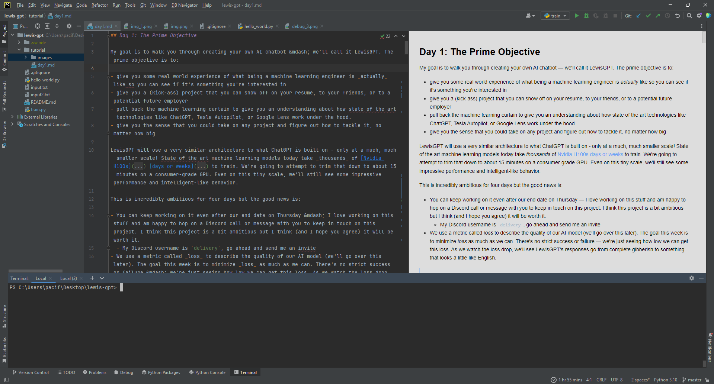

The left panel shows you your project folder and all of the files it contains. Every program is made up of one or more files that contain logically organized sectiosn of your code. At the bottom is a terminal that you can use to run commands. The "command line" is a special way to interact with your computer using text only. Most programs have a user interface for the non-geeks out there, but we're hardcode programmers, so we use the command line. The command line gives us a lot more power and flexibility to tell the computer exactly what we want it to run. The panel center is where you write your code.

To start, download PyCharm Community Edition [here](https://www.jetbrains.com/pycharm/download/?section=windows) and get it running on your machine. The professional edition requires a subscription, so we'll use the community edition.

## Setting up the project
To begin, click the "code" button and select "Download ZIP". Unzip the file and put it in a folder on your computer.

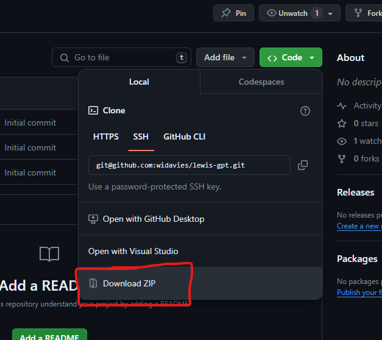

Next, go to https://raw.githubusercontent.com/ganesh-k13/shell/master/test_search/www.glozman.com/TextPages/01%20-%20The%20Fellowship%20Of%20The%20Ring.txt and download the file. Save it as `input.txt` into your project folder.

Now, open PyCharm and click "File" -> "Open..." and select your project folder.

Your PyCharm should look something like this (make sure it contains `input.txt`):

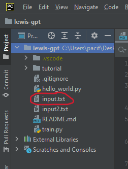

## Python
Go through [this quick Python introduction](https://www.w3schools.com/python/). the important sections are Python Intro through Python Classes/Objects. All of those sections are things we'll use in this project.

## Debugging
Programming can be really, really frustrating at times. Debugging is the slowest part of programming, it probably takes up 80% of the time during programming. There's tricks we can use though to make debugging easier:
 
- **Gather information and use the debugger.** The hardest thing in debugging is figuring out what the problem is, the rest is smooth sailing from there. Additionally, the more information you have, the easier it is to debug. In debugging then, the first goal is to isolate the piece of code that's causing the error - and error messages are your best way of figuring out what went wrong. When you run the program and get an error, it will give you an error message with what's called a stack trace. A stack trace shows what functions and files were involved in the error message. In the image below, we can figure out which line the error is happening by looking at the filename lowest on the stack trace. The upper files and line numbers in the stack trace show a little of what's happening under the hood with python, as you can see what files PyCharm uses for its python interpreter to run your program. In this error, we can see the source line 3 in the file ``hello_world.py``. We also have an explanation of the type of error: ``TypeError: unsupported operand type(s) for +: 'int' and 'str'``. This means we're trying to do an invalid operation on an integer and string (we're trying to add them together, which is invalid). We can go to the file and specific line if we click the blue file link. 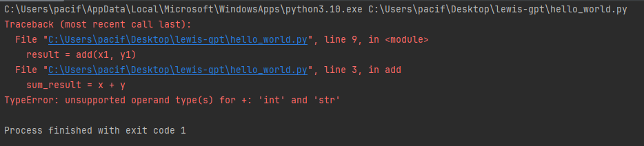  
  - Debugging is much easier if you use a debugger, a program in itself that runs your inside of it. It provides many features that allow us to track and resolve problems in the code. It monitors variables and allows you to set points to stop execution the code (breakpoints), where you can then inspect the values of variables to be able to better figure out what's going on. To be able to use the debugger in PyCharm, you click the little green bug icon. Running without the debugger (clicking the green triangle) has faster execution time, but you only get an error message and can't stop on breakpoints.  
  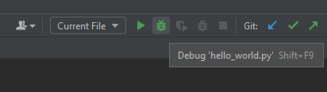  
  - In the screenshot below, I set a breakpoint on line 3 by clicking on the bar next to the file line (so a red dot shows up). When you run debug, it will halt execution on the line with the red dot, and as you can see in the lower dock of the IDE, the values of the variables show up. You can see the value and type of the objects. Thus, we can see the problem here: x is an integer, but y is a string, so we can't add the two.
  - To continue execution during the debug session, there are actions in the lower dock section in the debugger. The step over button will execute the line of code you're currently on. The step into button to the right will attempt to step into the function being called (so if you were to have the line ``print("hello")``, it would bring you into the ``print`` function and you could step through that function with the debugger. If you stepped into a function, you can step out of the function by clicking the step out button. This will run the rest of the current function you're in and spit you out at the line after the line that called that function. 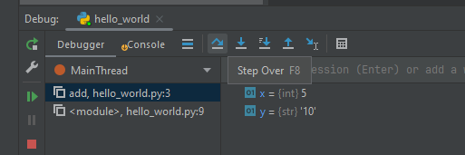   
  - Finally, to fix the error in ``hello_world.py``: If we look at the main function, where we call add(x1, y1) on line 9, we're feeding it a string numerical value. When we change y1 to ``10``, the code executes without error.  
    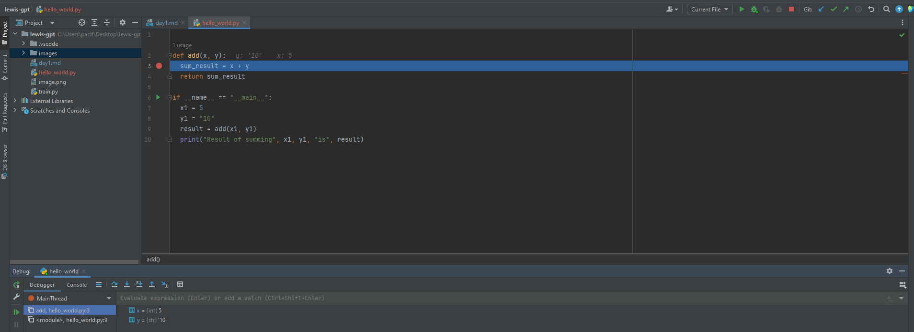
- **Research online.** If it's not an error that makes sense, or you haven't seen it before, Google is a great resource. I usually just type in the name of the language I'm programming in and copy and paste the entire error message, example: ``python name 'null' is not defined``. If you have variables that are specific to your program only (like "myLongVariableName") that show up in the error message, you might get better results if you remove those variables. Some of the best links that will show up:
  - [Stack Overflow](https://stackoverflow.com): A question and answer forum for computer programmers; the best resource for any kind of question you have about making something work in code. I always just use Google's search engine, and then click the stackoverflow links, since stack overflow's search engine isn't very good.
  - [W3 Schools](https://www.w3schools.com/python): This is the python tutorial linked above. For this project, this will be a really useful resource for learning the rules of python.
  - Blogs can sometimes be helpful, but start with stack overflow.  
  - [Python documentation](https://docs.python.org/3): The official python documentation, although the W3 schools link will probably be a little better of a resource for this project. Programming requires reading lots and lots of documentation (and eventually writing documentation yourself for projects you make). Writing documentation is every programmer's dreaded job, but it's super important for others who are trying to use your product or code. At this stage, the documentation should just be in the form of commenting your code with explanations of what the lines of code are doing.
  - Never use the website GeeksForGeeks, they are wrong 99.99% of the time
- **Slow down.** Slow down and step through your code, and if someone is willing, explain what your code is doing to them and walk them line by line through it. Countless times I've been frustrated with a bug, only to have someone slow me down and make me walk through the code, and I figure out where the bug is as I'm talking to them. It sounds counterintuitive, but sometimes slower _is_ faster.
- **Take a break.** Sometimes your brain just needs a refresh. Talk a walk, get some sleep if it's in the wee hours of the morning (when the best coding happens, of course), get a snack. I find myself thinking about the problem in the back of my mind, and when I come back to it, I find the bug much faster than when I was frustrated or tired.
- **Ask for help.** Come ask me if you're stuck, and other ways are to ask a question on Stack Overflow. But a warning, some people can be very strict about how you ask a question on Stack Overflow. Make sure you include the error message, a snippet of your code, a summary of your research and attempts at fixing the problem, and generally just try to be as detailed as you can in your question. The more information you share and research you've done beforehand will help people answer your question, since they can only understand as much as you give them.


## Getting started
Now that your coding environment is all set up, we can begin work on a very simple transformer - the ground work for our chatbot. A transformer is exactly what it sounds like - it takes an input, transforms it, and gives you an output.

We'll train our transformer on the complete text of "The Fellowship of the Ring" (our input). Once we're finished, our transformer will be able to generate infinite Tolkien-like text (our output).

### Framing the problem

We can think of this problem as a statistics problem &mdash; given a particular character, which character is most likely to come next? Theoretically, we could find each instance of `a` in our input and tally each of the characters that immediately follow it, and so on for every letter of the alphabet (these are called _bigrams_ by the way). For example, we might find that 50% of the time, the letter `e` follows the letter `t`. When we're generating our output - whenever we come across a `t`, we consult our probability table, select the character with the highest probability of occuring immediately after a `t` (which is `e` in our case) and append that to our output text.

This strategy is much better than random guessing - it eliminates a multitude of gibberish outputs (e.g. a `z` following a `t` is not a common pairing, so we shouldn't choose it often), but ultimately, it's far too limited for our purposes.

However, this idea forms the basis of our transformer - only instead of predicting which character is most likely to follow another, we'll predict which character is most likely to follow a _sequence_ of characters.

It turns out this is all that ChatGPT is doing - it knows that 99% of the time - "twinkle twinkle little ______" ends with "star".

### Loading the input data
We'll be doing all our work in [``train.py``](../train.py). To begin, let's load input file into our program:

```python
# Open 'input.txt' in "read" mode using the "utf-8" encoding
f = open('input.txt', 'r', encoding="utf-8")
# Actually read the contents of the input file into a variable called "text"
text = f.read()
print(text[:1000]) # read about array slices https://www.w3schools.com/python/numpy/numpy_array_slicing.asp
```

If you run this program, you should see the first 1000 characters of "The Fellowship of the Ring" printed to the console:
```
J. R. R. Tolkien ? The Lord Of The Rings. (1/4)
-----------------------------------------------
     THE LORD OF THE RINGS

              by

     J. R. R. TOLKIEN


 Part 1: The Fellowship of the Ring
 Part 2: The Two Towers
 Part 3: The Return of the King


_Complete with Index and Full Appendices_


          _Three Rings for the Elven-kings under the sky,
               Seven for the Dwarf-lords in their halls of stone,
            Nine for Mortal Men doomed to die,
              One for the Dark Lord on his dark throne
           In the Land of Mordor where the Shadows lie.
               One Ring to rule them all, One Ring to find them,
               One Ring to bring them all and in the darkness bind them
           In the Land of Mordor where the Shadows lie._
...
```

## Tokenization
> Goal: Fill out the `get_vocab`, `create_encode_mapping`, `create_decode_mapping`, `encode`, and `decode` functions

Next, we need to be able to transform our data into something we can do statistics on. Characters aren't much use to us as text, but we can transform characters into numerical values, "tokens", in a process called tokenization. In this project, we're going to do a simple conversion from each letter to a number. This allows us to represent a word as a sequence of tokens (sequence of numbers). 

State-of-the-art models will use larger tokens (multiple characters will be represented as a value, so instead of "a" tokenized to 17, it might tokenize a sequence "abc" to 17). This has cheaper execution time, but is a bit more complex, so we're going to use a simple single character tokenization.  

To accomplish tokenization, we need to determine what our vocabulary is - that is, the set of unique characters we have in our training set. This will allow us to convert letters to numbers. To do this, fill in the function ``get_vocab``. This takes a string and parses out all the unique characters in the dataset, returning a sorted list of characters.   

After obtaining the vocabulary, we need to be able to tokenize our data. To tokenize our data, we're going to use a simple indexing based mapping. The index of the character in the vocabulary represents the encoded token value of the character. For example, if our vocabulary is ``["a", "b", "c", "."]``, the encoding mapping would be ``"a" -> 0``, ``"b" -> 1``, ``"c" -> 2``, and ``"." -> 3``. The decoding mapping would just be the reverse of that, with ``0 -> "a"``, etc. Fill in the functions ``create_encode_mapping`` and ``create_decode_mapping``. These iterate through the vocabulary and create a [python dictionary](https://www.w3schools.com/python/python_dictionaries.asp) mapping of the encoding/decoding, and return that mapping.   

The next step is to apply the mapping: Fill out the functions ``encode`` and ``decode``. Encode takes a string and encoding mapping, and iterates through the string to convert it to a list of integer values, based on the mapping in the encoding mapping. Decode does the reverse with the decoding mapping to the list of integers passed in. 

To test your functions, run the code, making sure the function ``test_tokenization`` is uncommented. It has assert statements that will check values in your code and throw an error if it's not quite right. They'll show up as errors, but it just means the values don't match. If you run into this, set breakpoints and step through your code to determine where it's going wrong.  

 The final step of tokenization is converting our entire dataset into a tensor. A tensor is a multidimensional commonly used to store weights in neural networks. Tensors are extremely efficient in computations and will help our code run faster. We'll be using the library PyTorch's Tensor class. The function ``encode_all`` encodes the entire dataset and puts it into PyTorch's Tensor class. Nothing needs to be done for this function. 
However, to be able to use the library PyTorch, you need to install it. To install packages in python, we use a package manager called pip. This will handle looking up the package online, downloading, and installing it for us. Open up a terminal and run ``pip install torch``. Pip should have been automatically installed when you installed python, but if it says you don't have pip installed (pip command not recognized), run ``python -m ensurepip --upgrade`` or follow the directions [here](https://pip.pypa.io/en/stable/installation/). Torch will take a bit to download. If you run into issues installing torch, search the error online, and if you're still having issues, I can help too. This can be due to the python version you're using, or the permissions, it just depends on the machine.

## Training vs validation sets
> Goal: Fill out the `split_data` function

The next step is to split our dataset into training and test data. The split is necessary to be able to gain an idea of how good our model is. If we were to train on all the data, then there is a risk of overfitting. Overfitting is the condition where the machine learning model has trained its weights to fit the training data so well that it can't handle new data. It works extremely well for the training data, but any new data doesn't perform well. 

To be able to determine if we overfit the model, we need validation data, data the model has never seen before. Thus, we split the data into 90% training data and 10% validation data.

Fill out the split function ``split_data`` to separate the data into 90% training and 10% validation data. This returns a [python tuple](https://www.w3schools.com/python/python_tuples.asp) with the first element being the training data and the second element the validation data. Look into [python slicing](https://www.w3schools.com/python/python_strings_slicing.asp) here (hint: slicing doesn't just apply to strings, it works on lists)


## Contexts, sequences, targets, and batches
> Goal: Fill out `get_batch(data)` function

Let's circle back to prediction. Our goal is to create a model that predicts a _target_ character given the _sequence_ of characters that immediately preceeds it, the _context_:

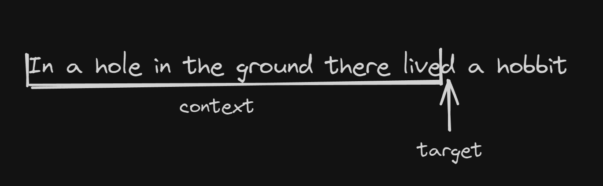

In the example above, the _context_ ("In a hole in the ground there live") has a length of 34 characters (including the spaces) with a target character `d`. In our example, let's start with a shorter context length of size `8`. Define a Python variable called `context_length` and set it to `8`.

Our code will support predictions using contexts from length `1` to `8`. Our transformer will take a context length between `1` and `8` and predict the next character in the sequence. We still need to train our model &mdash; we will format our input file into a series of example contexts and targets. Our machine learning model will "learn" from these examples so that in the future, we can just give it a context (but no target character) and get a predicted target character.

Here is _one_ example from the input data. For efficiency, using just two lists we can represent 8 different contexts and their corresponding 8 target characters:

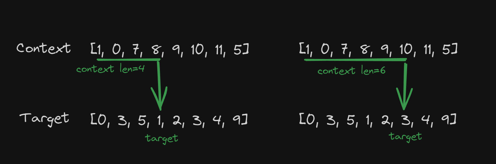

The context list represents 8 different contexts. Each context starts at the leftmost character and continues for 1, 2, 3, and so on more characters. The index of the last character in the context sequence corresponds to the index of the target character in the target list.

Next, we need to exploit the fact that computers are really good at matrix multiplication. In particular, your GPU is designed to do thousands of matrix multiplications in parallel. If we figure out how to format our problem into a matrix, we can speed up our training time significantly.

Define a Python variable called `batch_size` and set it to `4`. A batch is a collection of example context/target lists, in our case, 4 examples worth. Here's what that we look like:

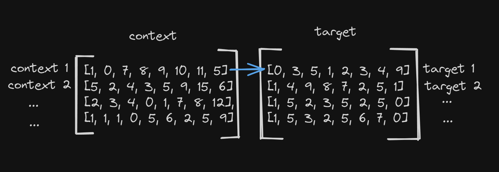

Each row in the context matrix contains a distinct context. The corresponding row in the target matrix contains the associated target list.
Each context/target pair is still distinct - context 1 and target 1 can see each other - but no one else.

Fill out the function prototype `get_batch(data)`:
- The function should pick `N=batch_size` random slices of `data` of length `context_length`. (Generate 4 random slices of length 8)
  - Be careful not to pick slices past the end of the list (`hint`: generate a random number to use as the start index using `torch.randint` that is between 0 and `len(data) - block_size`, what argument does `torch.randint` take? )
  - Remember how Python slices work: https://www.learnbyexample.org/python-list-slicing/
- For each context, pick the corresponding target list (the context list shifted right one index)
- Use the `torch.stack` function to create a matrix by stacking the 4 contexts into a matrix (call this matrix `x`) and the 4 targets into a matrix (call this matrix `y`)
- Call `return x, y` to return the context matrix and target matrix as a tuple

## A simple bigram neural network
> Goal: Fill out the `forward(..)` and `generate(..)` functions

From the last step, we created a function (`get_batch`) that picks a random context matrix and target matrix from our input data. Now, we can get to the neural network that links the two together. Our model is effectively just a hidden matrix we'll call `weights`, or `W`. We know that there must be some matrix `W` that we could multiply our context matrix by to get our target matrix.

In other words, there must be some matrix `W` such that:
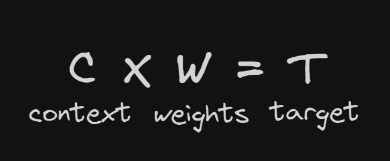

This is where the "learning" part of machine learning comes in. You might imagine a set of matrices whose dimensions are much bigger than the ones in our toy example. Trying to solve for `W` becomes a very tedious and slow process, even for a computer! Instead we define a _loss_ function that we can use to measure how accurate our `T` is to what it should be. The basic idea is:
- We start randomly generate a `W` and pick a random context matrix `C` and target matrix `T` from the input data
- Multiply `C * W` to get `T_predict`. Compare `T_predict` to `T`. Ideally they would be the same, but in reality our prediction isn't perfect. We define a _loss_ function that takes `T` and `T_predict` as inputs and returns a score of how similar they are.
- Because we know the loss function, we can work backwards (this is called "backpropagation") - we know how much `T_predict` should change to make it closer to `T` and then we work backwards again to adjust `W` accordingly.

> This slightly simplified, I can explain more in depth if you're interested.

For our purposes, PyTorch has built-in functions that will work out what `W` should be such that _loss_ is minimized. This process is called "optimzing" or "training" the model. We repeat the process above thousands of hundreds of thousands of times, guess `W`, compare with `T`, tweak
`W` so that loss gets smaller, and repeat.

Let's start by filling out `forward(..)`:
> Forward implements `C x W` multiplication and calculates the loss between `T` and `T_predict`
- `idx` is our `context` matrix. We can call `self.token_embedding_table(idx)` which takes the `context` matrix and multiplies it by the `W` matrix to get `T_predict`
  - Technically, PyTorch doesn't _actually_ multiply it out yet. It will instead attach a 3rd matrix dimension that includes the corresponding weights row in the multiplication.
- The `targets` variable is optional. This is because we use `forward` while training (in which case we need to calculate loss), but we also use
  it after training is complete (and we don't care about loss)
  - If target is _not_ `None`, calculate the loss between `prediction` and `target` using `F.cross_entropy(prediction, target)`. Name this `loss`.
    - `F.cross_entropy(..)`  expects two arguments. The first should be a 2D array of predictions and the second a 1D array of targets. To do this,
      use `predictions.view(..)` and `targets.view(..)` to reshape the predictions matrix into a `32 (batch_size * context_length) x 80 vocab_size` matrix and a `(batch_size * context_length)` matrix
    - Return `prediction, loss`
  - If target is `None`, just return `prediction, None`

Next, fill out the `generate(..)` function:
- `generate` is used to generate text from the model after it's been trained. `generate(..)` takes `idx` as an argument (the context) and `max_new_tokens`, which is the number of new tokens to generate (in our example, characters)
- First, call `self.forward` to get the predicted target matrix.
  - Remember, the target matrix contains multiple entries for a variety of context sizes
- We only care about the final character, so use `prediction[:, -1, :]` to select the last predicted character.
  - This changes the matrix from 3D to 2D - this new 2D array contains one row for each context in the batch (separate contexts) where each row
    is the length of the vocab and each cell is the probability of that character being the next character in the sequence.
- Use `F.softmax(prediction, dm=-1)` to normalize the cells to probabilities between 0 and 1
- Normally, we would just pick the character with the highest probability, but we will use `torch.multinomial(probabilities, num_samples=1)` to add some randomness to the model.
- Use `torch.multinomial(probabilities, num_samples=1)` 
- Concat the newly generated character onto the generated text.

## Running the model
Start with an empty context:
`context = torch.zeros((1, 1), dtype=torch.long)`

Then, call `m.generate` to generate new text.

Call `decode(..)` to convert the generated text from numbers back to characters.

Use `print(..)` to print the generated text.

And.... it's all gibberish! That's okay though, we haven't trained the model yet and just left the weights randomized, so this is expected. We'll go over training tomorrow or Wednesday.

## Appendix
- If you're looking for a really fun channel on AI - check out [Code Bullet](https://www.youtube.com/@CodeBullet)